# Pharmaceutical Litigation Outcomes and Equity-Market Reaction

## What happens to a pharmaceutical company's stock when it wins or loses in court?

> **Status:** Research prototype
> **Methods used:** regularized logistic regression, cross-validation, permutation importance, event-study analysis, abnormal-return estimation, randomization inference, ticker-clustered uncertainty estimates

This repo digs into federal litigation records for pharmaceutical companies and pairs them with daily stock prices, asking two things: can we predict who wins a case, and does the market actually react when they do?

> **A note on interpretation:** everything here is about statistical association, not causation. Finding that a variable predicts case outcomes doesn't mean it causes them, and finding a stock-price pattern around a legal event doesn't prove the litigation caused it.

---

## Abstract

Two questions drive this project. First: what can we learn from a case's basic characteristics about whether the pharma company involved will win or lose? Second: does the stock market treat wins differently from losses, and does that depend on whether we're looking at the filing date or the closing date of the case?

For the outcome question, I worked with 1,288 cases, a pretty even split of 667 wins and 621 losses. A logistic model using only information available around the time of filing gets an out-of-sample ROC AUC of 0.71. Throwing in case duration and document volume nudges that up to 0.7152. Barely worth the added complexity, since most of the signal is already there at filing. Party type (was the company the plaintiff or defendant?) and judicial district turn out to be the biggest predictors, though both come with caveats: party type is baked into how the win/loss label itself gets constructed, and district effects could easily be standing in for other things, like the kinds of cases that tend to get filed there.

The market side is murkier. I looked at abnormal returns around both the filing date and the closing date, over 1-, 5-, and 10-day windows. Around filing, eventual winners show slightly better returns than eventual losers. Around closing, it's the opposite, and the gap actually widens the longer you look. But here's the catch: every single confidence interval, at every horizon, includes zero. So while there's a directional story here, good news at filing, bad news at closing. It's not one the data can back up with any statistical confidence.

Bottom line: legal outcomes are moderately predictable. Stock reactions to those outcomes are not reliably detectable, at least not with this data and this design.

---

## Contents

- [Research questions](#research-questions)
- [Data and variable construction](#data-and-variable-construction)
- [Repository structure](#repository-structure)
- [Quick start](#quick-start)
- [Key findings at a glance](#key-findings-at-a-glance)
- [Methodology](#methodology)
- [Litigation outcome results](#litigation-outcome-results)
- [Equity-market event-study results](#equity-market-event-study-results)
- [Integrated interpretation](#integrated-interpretation)
- [Limitations and robustness](#limitations-and-robustness)
- [Recommended extensions](#recommended-extensions)
- [Data sources and citations](#data-sources-and-citations)
- [Reproducibility](#reproducibility)
- [Figure file guide](#figure-file-guide)
- [Conclusion](#conclusion)

---

## Research questions

1. **What case level factors are tied to whether the pharma company wins?**
2. **Do wins and losses produce different stock-price reactions around filing and closure?**

For the second question, I'm comparing two moments in a case's life:

- **Filing** — the first trading day on or after `date_filed`
- **Closure** — the first trading day on or after `date_closed`

and three windows after each: 1 day (just day 0), 5 days (days 0–4), and 10 days (days 0–9).

These two dates aren't interchangeable. Filing tells the market a dispute exists and gives some sense of what kind. Closure is supposed to mark resolution, but in practice the administrative closing date can lag well behind the actual verdict, settlement, or news that moved the stock.

---

## Data and variable construction

### Litigation data

Each case record includes the company and ticker, case number, the company's role in the case (plaintiff or defendant), judicial district, filing and closing dates, attorney counts on each side, document counts, jury-demand flags, and a recorded outcome which side, plaintiff or defendant, actually won.

That last field only tells you who won on paper (plaintiff or defendant) not whether *the pharma company* won, since the company could be sitting on either side. So the company-level result has to be derived:

| Company's role | Recorded outcome | Company result |
|---|---|---|
| Plaintiff | Plaintiff | Win |
| Plaintiff | Defendant | Loss |
| Defendant | Defendant | Win |
| Defendant | Plaintiff | Loss |
| Any | Both | Mixed |
| Any | Missing/unknown | Unknown |

Only the clean wins and losses feed into the model. Mixed and unknown cases stay in the dataset for auditing but get excluded from the main analysis.

### Stock price data

Daily prices by ticker, and the event study needs at minimum `Date`, `Ticker`, and `Close`,though the raw file also has open/high/low/volume/dividends/splits.

Returns are log returns on `Close`:

```math
r_{i,t} = \log(P_{i,t})-\log(P_{i,t-1}).
```

One thing worth flagging before trusting any of these numbers too much: it's not yet confirmed that `Close` is properly split- and dividend-adjusted. The fact that dividends and splits are recorded as separate columns is a hint that `Close` might just be a raw price series. This matters a lot here, because one of the 10-day return observations comes in near **-80%**, which could be a real crash, or could just be an unadjusted stock split messing up the math.

---

## Repository structure

```text
.
├── README.md
├── fuzzy_match_pharma.py
├── litigation_stock_analysis.py
├── outcome_finder.py
├── run_litigation_analysis.py
├── requirements.txt
└── figures/
    ├── goal1_empirical_win_rates.png
    ├── goal1_full_coefficient_forest.png
    ├── goal1_full_permutation_importance.png
    ├── goal2_date_closed_1d_car_distribution.png
    ├── goal2_date_closed_5d_car_distribution.png
    ├── goal2_date_closed_10d_car_distribution.png
    ├── goal2_date_closed_cumulative_abnormal_return.png
    ├── goal2_date_closed_daily_abnormal_return.png
    ├── goal2_date_filed_1d_car_distribution.png
    ├── goal2_date_filed_5d_car_distribution.png
    ├── goal2_date_filed_10d_car_distribution.png
    ├── goal2_date_filed_cumulative_abnormal_return.png
    ├── goal2_date_filed_daily_abnormal_return.png
    └── goal2_win_loss_effect_by_event_date.png
```

The raw litigation and stock data, along with intermediate outputs, live in local `data/` and `litigation_results/` folders that aren't checked into the repo, mostly a matter of file size and data licensing. You'll need to source these yourself to reproduce anything below.

## Quick start

### 1. Clone the repository

```bash
git clone https://github.com/diascencio/pharma_patent_litigation-stock-analysis.git
cd pharma_patent_litigation-stock-analysis
```

### 2. Set up a virtual environment

macOS/Linux:

```bash
python -m venv .venv
source .venv/bin/activate
python -m pip install --upgrade pip
pip install -r requirements.txt
```

Windows PowerShell:

```powershell
python -m venv .venv
.venv\Scripts\Activate.ps1
python -m pip install --upgrade pip
pip install -r requirements.txt
```

### 3. Get the input data in place

You'll need two files that aren't bundled with the repo:

- `data/cleaned_dataframe.csv` — the cleaned litigation case data
- `data/all_stock_data.csv` — daily stock prices

```bash
mkdir -p data litigation_results
```

The litigation file needs case, company, party-role, outcome, attorney, district, and date fields. The stock file needs at minimum `Date`, `Ticker`, and `Close`.

### 4. Run it

```bash
python run_litigation_analysis.py \
  --cases data/cleaned_dataframe.csv \
  --stocks data/all_stock_data.csv \
  --output-dir litigation_results
```

Tables and intermediate output land in `litigation_results/`; the figures cited throughout this README live in `figures/`.

## Key findings at a glance

Structured litigation data turns out to be genuinely useful for predicting outcomes, the filing-time logistic model hits an out-of-sample ROC AUC around **0.71**, and adding post-filing information (case duration, document count) barely moves the needle. Most of what's predictable about a case is already knowable near filing.

Party type and judicial district are the standout predictors, but both need to be read carefully. Party type is mechanically tied to how the outcome label itself was built, and district effects likely reflect differences in the kinds of cases, firms, and judges that show up there, rather than some inherent "home court" effect.

The stock-market side of things is weaker. Cases that eventually turn into wins show somewhat better returns around filing, and somewhat worse returns around closure, but every confidence interval on these estimates, at every horizon tested, crosses zero. The closure-date results in particular are heavily swayed by one extreme observation in the 10-day window.

So the fair summary is:

> **Litigation characteristics tell you a fair amount about how a case will turn out. They don't yet tell you much, reliably, about what the stock will do because of it.**

---

## Methodology

### Legal-outcome model

The outcome variable, from the company's point of view:

```math
Y_i =
\begin{cases}
1, & \text{company wins case } i,\\
0, & \text{company loses case } i.
\end{cases}
```

As noted above, this has to be constructed from the raw outcome plus the company's role in the case.

The model itself is L2-regularized logistic regression:

```math
\Pr(Y_i=1\mid X_i)
=
\frac{\exp(X_i^\top\beta)}
{1+\exp(X_i^\top\beta)}.
```

Two versions get fit:

- **Ex-ante** — only what's known around filing time
- **Full** — ex-ante plus case duration and document count

The ex-ante version is the more honest one to use for actual forecasting, since it doesn't peek at information that only exists once a case has already played out.

### Event-study model

For each company and event, day 0 is the first trading day on or after the relevant legal date. A market model gets fit over a pre-event window:

```math
r_{i,t} = \alpha_i + \beta_i r_{m,t} + \varepsilon_{i,t},
```

where the benchmark return $r_{m,t}$ is an equal-weight average of all the *other* stocks in the sample on that date (so a given stock never gets benchmarked against itself).

```math
\widehat r_{i,t}=\widehat\alpha_i+\widehat\beta_i r_{m,t},
\qquad
AR_{i,t}=r_{i,t}-\widehat r_{i,t}.
```

Cumulative abnormal return over a horizon $H$:

```math
CAR_i(0,H-1)=\sum_{\tau=0}^{H-1}AR_{i,\tau}.
```

And the comparison everyone actually cares about:

```math
\Delta_H
=
\overline{CAR}_{\text{wins},H}
-
\overline{CAR}_{\text{losses},H}.
```

Positive means wins outperformed; negative means they underperformed.

---

## Litigation outcome results

### Sample and performance

| Statistic | Value |
|---|---:|
| Total modeled cases | 1,288 |
| Company wins | 667 |
| Company losses | 621 |
| Win rate | 51.8% |

Nice and balanced, which makes ROC AUC and balanced accuracy meaningful rather than misleading.

| Model | ROC AUC | Balanced accuracy | Brier score | Log loss |
|---|---:|---:|---:|---:|
| Ex-ante | 0.7097 | 0.6906 | 0.2173 | 0.6362 |
| Full | 0.7152 | 0.6882 | 0.2163 | 0.6342 |

An AUC of 0.71 means that if you grabbed a random win-loss pair, the model would rank the actual winner higher about 71% of the time. That's real signal, but a long way from certainty. The full model only picks up an extra 0.0055 AUC, and balanced accuracy actually dips slightly, so post-filing variables aren't earning their keep here. The ex-ante model does almost all the work on its own, which is a useful finding in itself: you don't need to wait and see how a case unfolds to get most of the predictive value.

---

### Unadjusted win rates

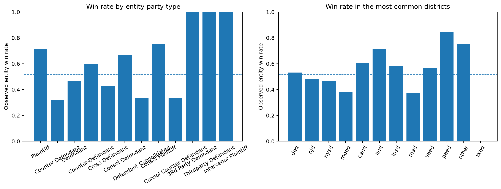

*Figure 1. Observed win rates by party type and by the most common districts. Dashed line = overall sample average.*

**Party type.** Companies filing as plaintiffs win noticeably more often than companies defending themselves. A handful of rarer roles show 100% win rates, but don't read too much into that, a category with exactly one case and one win also scores 100%. A cleaner version of this chart would show sample sizes per bar and some confidence intervals.

Party type is genuinely predictive, but remember it's not a normal independent variable. It's part of how the win/loss label gets built in the first place, so some of its "predictive power" is circular by construction.

Some of the rarer role labels (counter-defendant, cross-defendant, third-party defendant, and so on) don't map cleanly onto a simple plaintiff/defendant split and would benefit from manual review.

**District.** Win rates vary a fair bit by district too. Some run well above the sample average, some well below. This is descriptive, not causal. Districts differ in the types of claims filed there, the companies involved, the judges, and plenty else. A high win rate in a given district doesn't mean filing there gives you better odds; it might just mean easier cases tend to land there.

---

### Adjusted logistic-regression effects

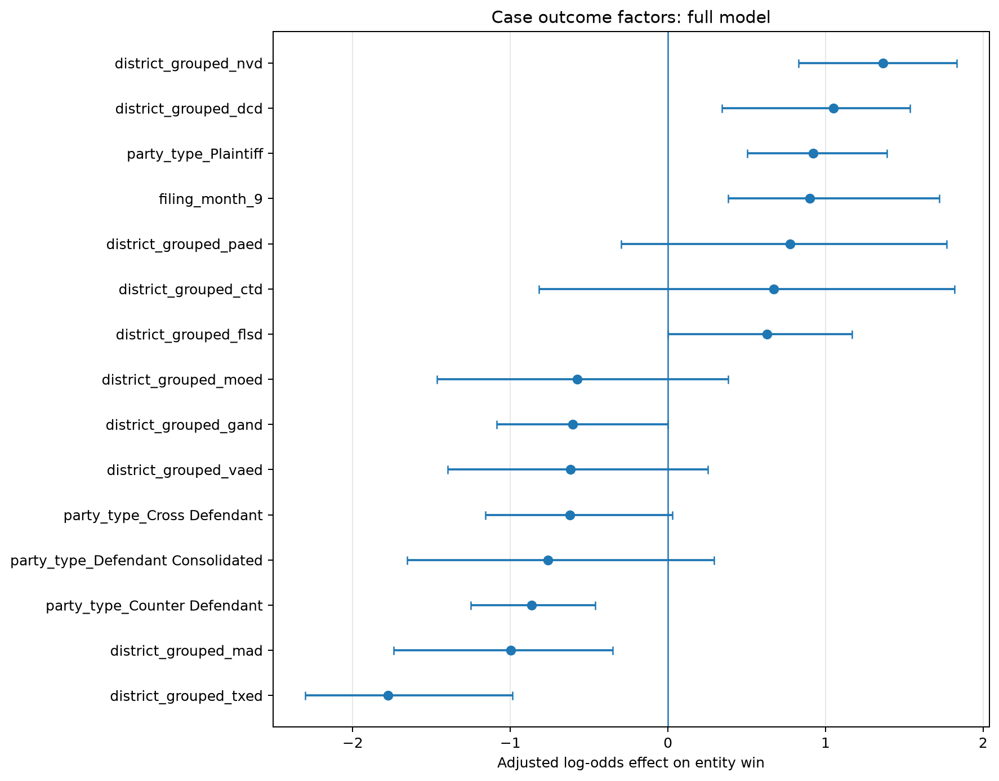

*Figure 2. Largest adjusted log-odds coefficients from the full model. Bars crossing zero are unstable.*

**On the positive side:** Nevada and DC districts, plaintiff status, and September filings all show up with notably higher odds of winning.

| Factor | Odds ratio | Bootstrap interval | Reading |
|---|---:|---:|---|
| District of Nevada (`nvd`) | 3.918 | 2.292–6.246 | Higher win odds |
| District of Columbia (`dcd`) | 2.857 | 1.409–4.654 | Higher win odds |
| Plaintiff | 2.509 | 1.654–4.006 | Higher win odds |
| September filing | 2.455 | 1.463–5.593 | Higher win odds |

Worth remembering: an odds ratio isn't a probability shift. A ratio of 3.918 means roughly 3.9x the reference odds, holding everything else fixed, not "39% more likely to win."

Several of the smaller positive district effects have wide intervals that touch zero, so treat those as suggestive at best.

**On the negative side:** Eastern Texas and Massachusetts districts, and counter-defendant status, all come in with lower win odds.

| Factor | Odds ratio | Bootstrap interval | Reading |
|---|---:|---:|---|
| Eastern District of Texas (`txed`) | 0.169 | 0.100–0.373 | Lower win odds |
| District of Massachusetts (`mad`) | 0.369 | 0.176–0.704 | Lower win odds |
| Counter-defendant | 0.420 | 0.286–0.631 | Lower win odds |
| Southern District of New York (`nysd`) | 0.590 | 0.356–0.905 | Lower win odds |
| District of Delaware (`ded`) | 0.635 | 0.384–0.981 | Lower win odds |
| Defendant | 0.660 | 0.434–0.945 | Lower win odds |

The Eastern Texas number jumps out, but again, this is likely more about who ends up filing there than about the court itself.

**A caveat on reference categories.** Every one of these coefficients is relative to some omitted baseline category, and the current output doesn't record what that baseline is for district, party type, or month. That needs to be pinned down before anyone leans too hard on individual numbers. And with this many districts, parties, and months being compared at once, some of the larger coefficients are probably just noise. A proper follow-up should apply multiple-comparison correction or shrinkage.

---

### Permutation importance

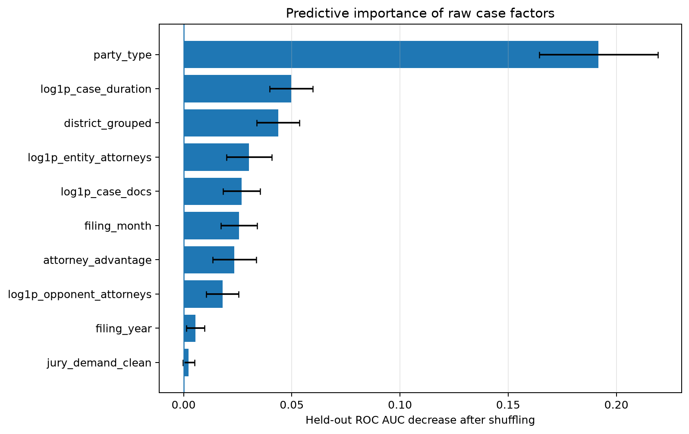

*Figure 3. Drop in held-out ROC AUC when each feature is shuffled.*

Party type towers over everything else here, shuffling it costs about 0.19 AUC, far more than any other feature. As mentioned, some of that is mechanical, since party type feeds directly into the label.

Ranked below it:

1. log case duration
2. judicial district (grouped)
3. log company-side attorney count
4. log document count
5. filing month
6. attorney advantage
7. log opponent attorney count
8. filing year
9. jury demand

Case duration and document count are post-filing variables, so their importance doesn't mean longer or more document-heavy cases *cause* wins. They might just track complexity or settlement dynamics. Attorney counts likely stand in for financial stakes or firm resources rather than being causal levers on their own. Jury demand barely registers.

---

### Litigation-outcome takeaways

Three things stand out. Litigation records carry real predictive signal, not perfect, but clearly better than a coin flip. Almost all of that signal is available right at filing, so waiting for a case to develop doesn't buy you much. And party type and district dominate the model, which is useful for prediction but shouldn't be mistaken for a causal story.

> **Company role and judicial district are strongly tied to the recorded win/loss label; attorney-team size adds a smaller amount of information; and variables from later in the case's life add little once filing-time data is already accounted for.**

---

## Equity-market event-study results

### Filing vs. closure as events

Filing can tip the market off that a dispute exists and give a sense of its shape. Closure is supposed to mark the resolution, but the recorded closing date often trails the moment that actually mattered economically (the verdict, the settlement, the news story).

The filing-date analysis is retrospective by nature: nobody knows at filing time how the case will end, so this is really asking whether cases that *later* turn into wins already looked different at filing. It's not evidence that the market predicts outcomes.

The closure-date analysis is closer to a true outcome event, but again, `date_closed` isn't necessarily when the market actually learned what happened.

---

### Closure-date results

#### One day after closure

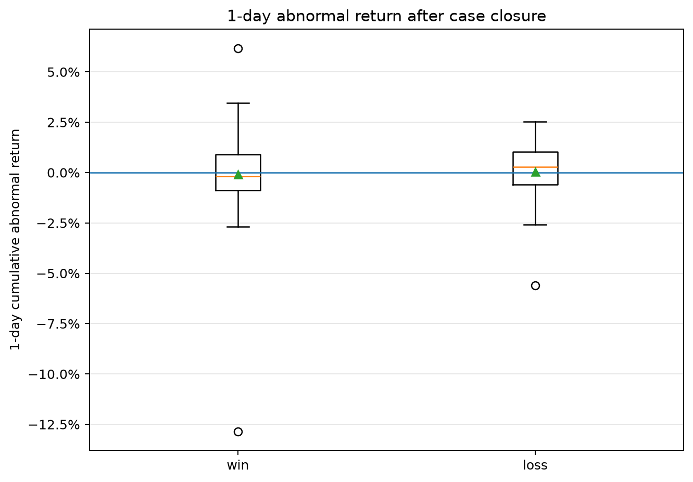

*Figure 4. Day-0 abnormal returns after closure.*

Wins and losses both cluster near zero and overlap heavily. Wins skew very slightly negative; losses sit around zero or slightly positive. The win group has a rough outlier near -13% and another near +6%; losses have one near -5.5%. With numbers this thin, the mean is easily thrown off by a single case (medians and trimmed means would tell a steadier story).

#### Five days after closure

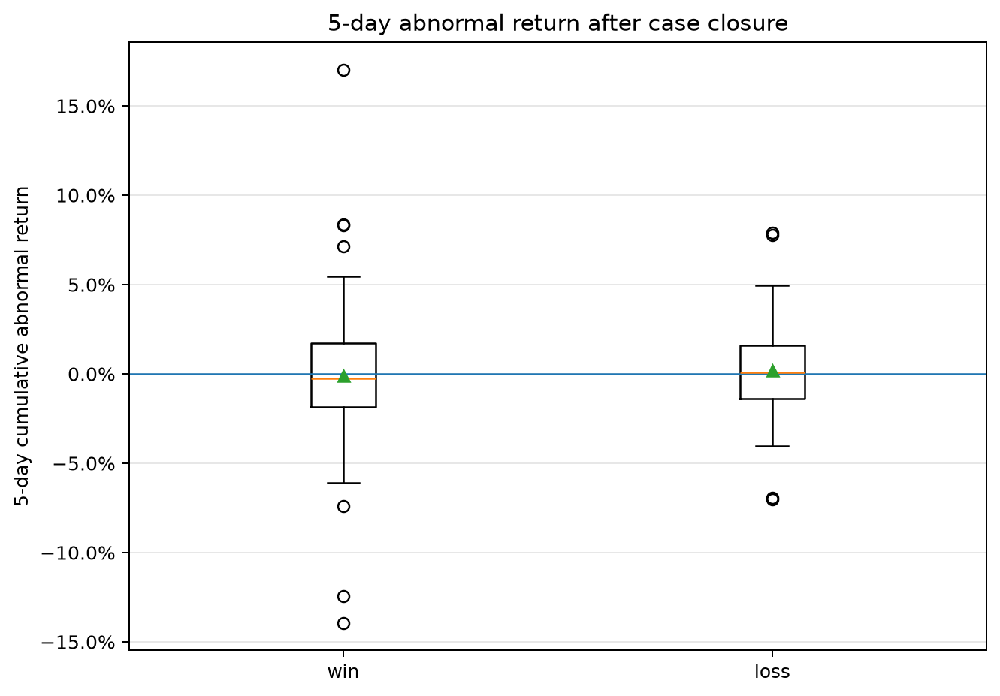

*Figure 5. Cumulative abnormal returns, days 0–4, after closure.*

Same story, a bit noisier (medians for both groups stay near zero, wins tilt slightly negative on average, and the overlap between the two distributions is too large to call a real separation).

#### Ten days after closure

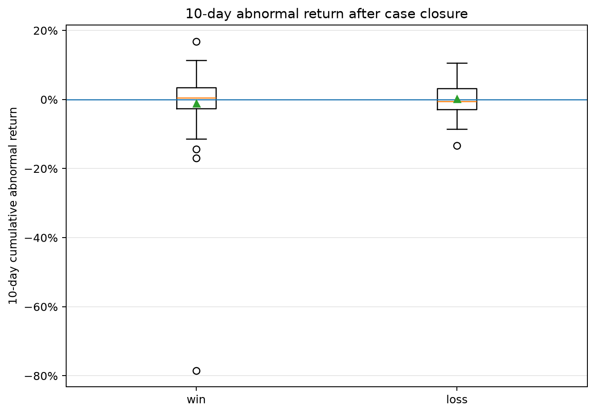

*Figure 6. Cumulative abnormal returns, days 0–9, after closure.*

This one's dominated by a single extreme case in the win sample (a return near **-79%**). That one data point is doing most of the work in pulling the 10-day closure estimate negative. The medians stay much closer to zero than the mean suggests. Before reading anything into this, that case needs a real audit: ticker, case number, exact dates, whether the price series was split/dividend adjusted, any merger or delisting, and what else was happening with the company at the time. The 10-day result should be reported both with and without it.

#### Path around closure

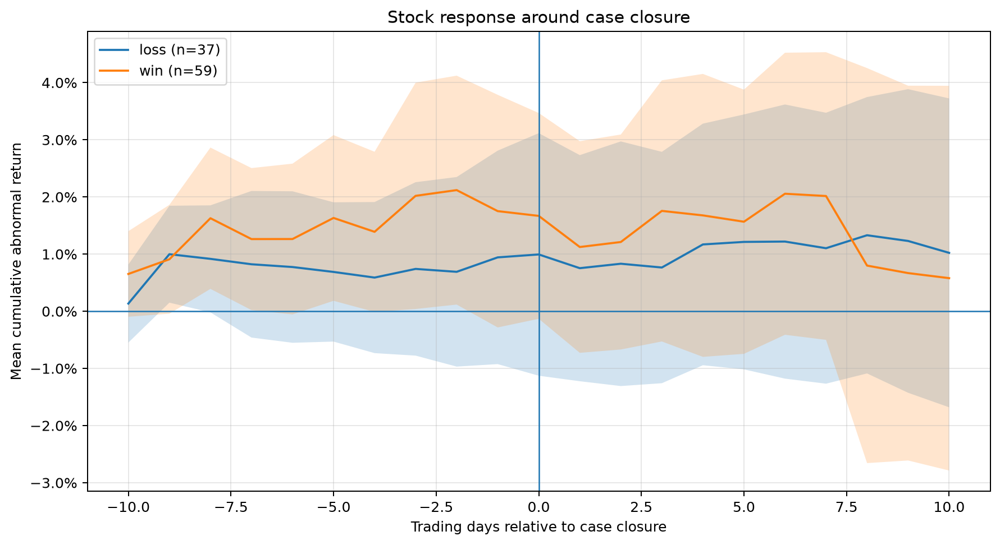

*Figure 7. Mean cumulative abnormal returns, day -10 to +10, around closure.*

About 59 win events and 37 loss events here. Both paths trend upward *before* day 0, and there's no sharp jump right at closure, which itself is a hint that the closing date might not be the moment the market actually reacted. The two paths track each other closely until around day 7, where the win path drops off, consistent with that outlier case.

#### Daily returns around closure

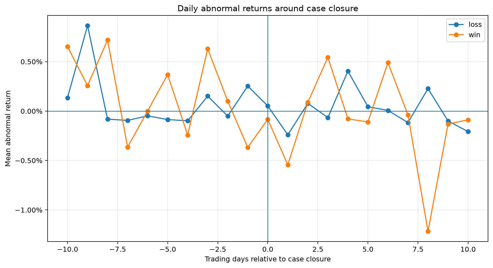

*Figure 8. Mean daily abnormal returns, day -10 to +10, around closure.*

Mostly noise around zero for both groups, no clean pattern after closure. There's a sharp negative dip for wins around day 8, again, that one outlier case showing up. No concentrated day-0 reaction reinforces the idea that the administrative closing date isn't really the news event.

---

### Filing-date results

#### One day after filing

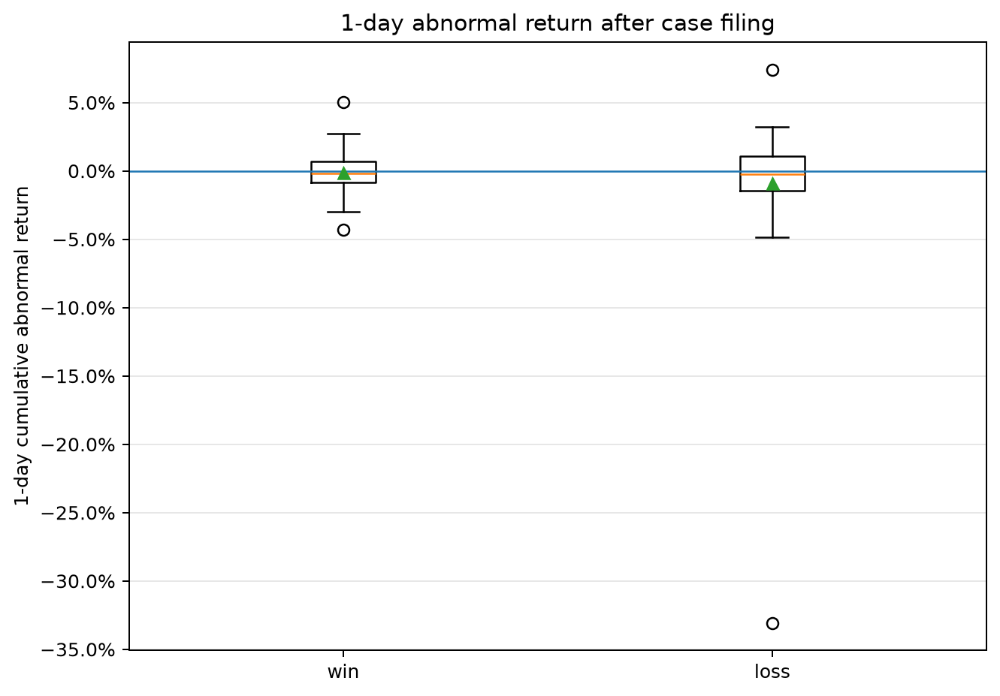

*Figure 9. Day-0 abnormal returns after filing, grouped by eventual outcome.*

Eventual wins sit near zero with a small negative tilt. Eventual losses run more negative on average and include one sharp outlier near -33%. So the "wins beat losses" gap here is partly just the loss group getting dragged down by one bad case, not eventual winners uniformly celebrating at filing. To be clear, the market has no idea at filing time who's going to win. This is purely a retrospective grouping.

#### Five days after filing

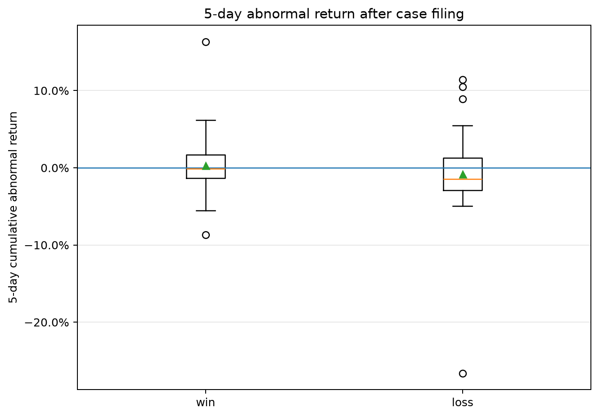

*Figure 10. Cumulative abnormal returns, days 0–4, after filing.*

Eventual wins hover near zero; eventual losses run more negative on both mean and median, though the loss group also has some big swings in both directions. Real overlap between the groups, so this reads as a mild average tendency, not a hard rule.

#### Ten days after filing

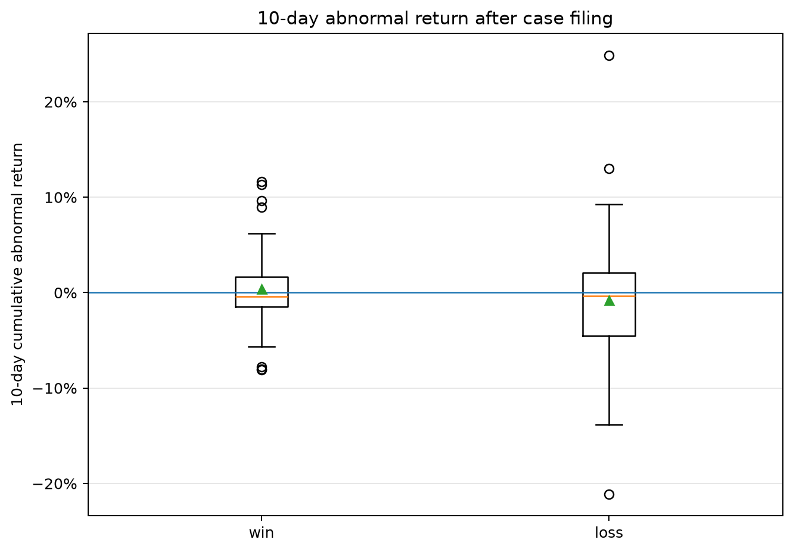

*Figure 11. Cumulative abnormal returns, days 0–9, after filing.*

Eventual wins land near zero or slightly positive; eventual losses average negative, with a much wider spread of outcomes. Directionally consistent with the shorter windows, but with this much overlap and this many outliers, it's not something you'd bet on case by case.

#### Path around filing

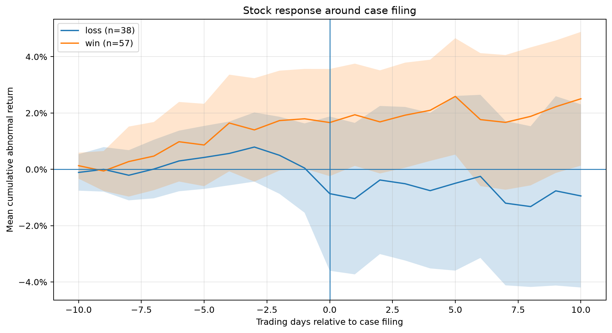

*Figure 12. Mean cumulative abnormal returns, day -10 to +10, around filing.*

About 57 eventual-win events, 38 eventual-loss events. The separation is a bit cleaner here than around closure (eventual wins drift into positive territory, eventual losses into negative). By day 10, roughly +2.5% for wins versus -1.0% for losses (note: these are cumulative from day -10, not the same as the post-event CAR numbers above). Still, the uncertainty bands are wide and overlap a lot, so "suggestive" is about as far as this goes. Could be case severity, claim type, plaintiff identity, or just noise from other company news.

#### Daily returns around filing

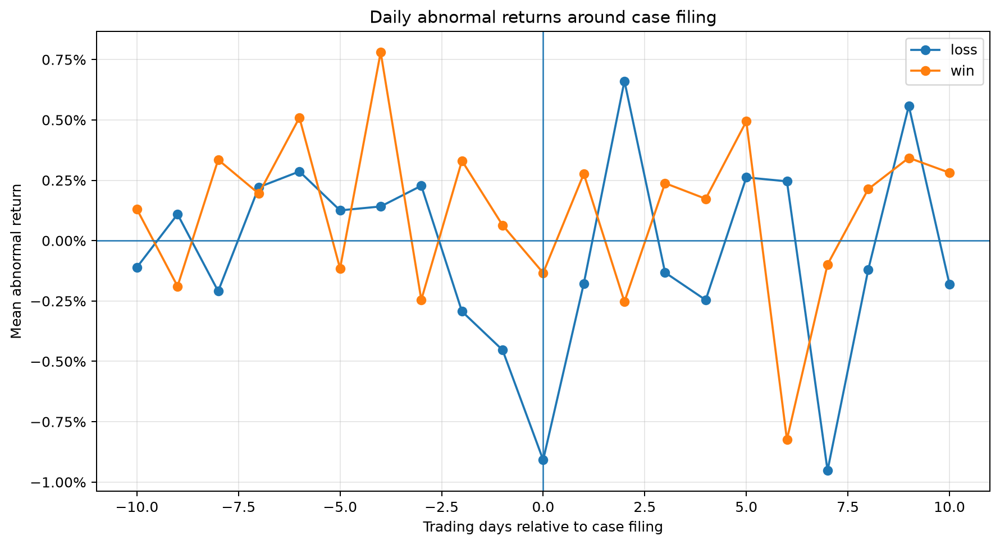

*Figure 13. Mean daily abnormal returns, day -10 to +10, around filing.*

The clearest single moment is day 0 itself: eventual losses average around -0.9%, eventual wins barely move, which is most of where the positive win-minus-loss gap comes from. After that it's choppy; the loss group actually bounces back hard on day 2. No smooth, sustained pattern, so the cumulative gap isn't being driven by one steady daily effect.

---

### Filing vs. closure, side by side

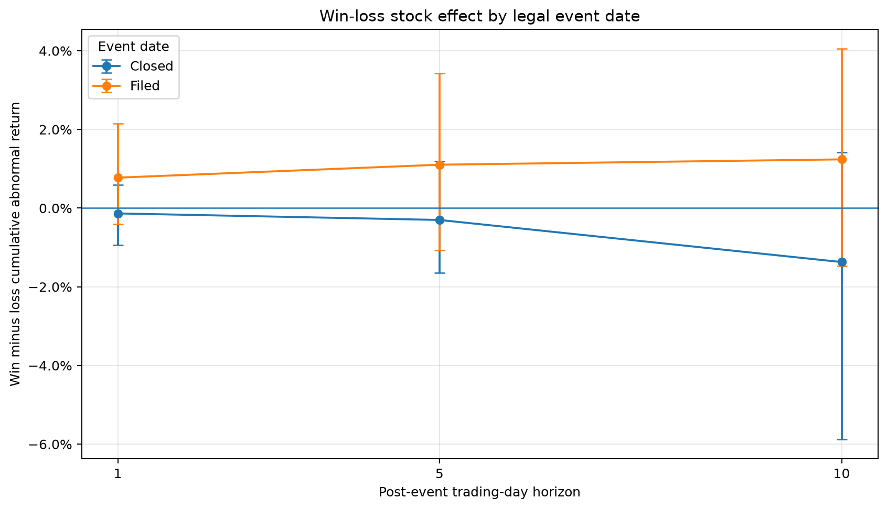

*Figure 14. Win-minus-loss CAR at 1, 5, and 10 days for both event dates, with ticker-cluster bootstrap intervals.*

| Event date | Horizon | Approx. win-minus-loss CAR | Direction | CI includes zero? |
|---|---:|---:|---|---|
| Filed | 1 day | +0.8% | Wins ahead | Yes |
| Filed | 5 days | +1.1% | Wins ahead | Yes |
| Filed | 10 days | +1.2–1.3% | Wins ahead | Yes |
| Closed | 1 day | -0.1 to -0.2% | Wins behind | Yes |
| Closed | 5 days | ~ -0.3% | Wins behind | Yes |
| Closed | 10 days | ~ -1.4% | Wins behind | Yes |

The pattern's consistent, positive around filing, negative around closure, at every horizon, but every single interval crosses zero. The filing gap grows a little with horizon; the closure gap grows a lot, though that 10-day number comes with a very wide interval, unsurprising given the outlier problem.

So the honest conclusion is:

> **There's no statistically solid evidence of a difference in post-event abnormal returns between wins and losses, at either filing or closure, over 1, 5, or 10 days.**

The directional asymmetry is still interesting and worth chasing further, just not something to present as a confirmed effect yet.

---

## Integrated interpretation

### Predictable outcomes, unclear stock reaction

Here's the interesting tension in this project: legal outcomes are fairly predictable from case characteristics, but the stock market's reaction to those outcomes isn't showing up clearly in the data.

That's not actually contradictory. A case can be predictable and still barely move the stock, maybe the market already priced it in, maybe the case is small relative to the company, maybe insurance covers it, maybe the firm's diversified enough that one lawsuit doesn't matter, or maybe something else entirely dominated the news that week. Predicting who wins and detecting whether the market cares are just different questions.

### Main takeaways

- 1,288 cases, nearly balanced between wins (667) and losses (621)
- Ex-ante model: 0.7097 ROC AUC; full model barely better at 0.7152
- Party type dominates the model, followed by district and case duration
- Attorney-team size adds a little; jury demand adds almost nothing
- Some district/party coefficients are large but shouldn't be read causally
- A few rare party categories show 100% win rates (small-sample artifacts)
- Closure-date returns for wins and losses overlap heavily
- The 10-day closure estimate is largely driven by one -79% outlier
- Filing-date returns lean more favorable for eventual winners
- Win-minus-loss estimates are positive at filing, negative at closure, at every horizon
- Every one of those confidence intervals includes zero
- No statistically robust stock-price effect of winning vs. losing has been found here
- The filing/closure asymmetry is a good hypothesis to chase in future work

---

## Limitations and robustness

**How the outcome label gets built.** Company win/loss comes from combining party role with the raw legal outcome. Rarer roles don't map cleanly onto plaintiff/defendant, so a manual review of the role taxonomy would help.

**Cross-validation leakage.** Random row-level splits could put the same company, or related cases, in both training and validation. Grouping the folds by case number or ticker, or validating across time instead would be a sturdier approach.

**What's missing.** No cause of action, no judge identity, no damages claimed, no settlement amounts, no info on verdict vs. settlement vs. dismissal. District and party effects are probably absorbing some of this.

**Is closure the right event date?** Administrative closure often isn't the moment that mattered economically. The pre-closure drift and lack of a sharp day-0 move in the figures both point that way (verdict date, settlement announcement, or first news coverage might be better anchors).

**Price adjustment.** The event study needs properly adjusted (or total-return) prices. Any case with |CAR(0,9)| > 20% deserves a manual check for splits, dividends, mergers, delistings, or bad data.

**Outlier sensitivity.** Medians, trimmed means, winsorized estimates, and leave-one-out checks should sit alongside the plain means throughout.

**Other news.** Pharma companies get hit with plenty of non-litigation news (trial results, FDA rulings, earnings, M&A. Some of that is almost certainly leaking into these event windows).

**Benchmark choice.** The leave-one-out equal-weight benchmark avoids obvious self-contamination but might miss broader market or sector exposure. A sector index or factor model would be a useful comparison.

**Multiple comparisons.** With this many districts, categories, and horizons being tested, some "significant-looking" results are bound to be noise. A pre-registered primary hypothesis with FDR control would tighten this up.

---

## Recommended extensions

**Tie predicted outcomes to market surprise.** Define surprise as actual win minus predicted win probability, then regress CAR on predicted probability, actual outcome, and surprise together. If markets are reasonably efficient, the *surprise* term should matter more than the predictable part.

**Add firm and time controls.** Ticker fixed effects, year fixed effects, market cap, historical volatility, case-type controls.

**Measure how much each case actually matters.** Classify cases by potential exposure (damages claimed, share of revenue at stake, insurance coverage) since a real stock effect is probably easier to find among the cases that are big enough to matter.

---

## Data sources and citations

- Toole, A., R. Miller, and T. Sichelman (2024), "Technical Documentation for Patent Litigation Reports Data, 1963–2020," *USPTO Economic Working Paper No. 2024-01*, [SSRN](https://papers.ssrn.com/sol3/papers.cfm?abstract_id=4780166).
- Case records: Federal Judicial Center's [Integrated Database](https://www.fjc.gov/research/idb).
- Tickers and CIK identifiers: SEC [company ticker dataset](https://www.sec.gov/files/company_tickers.json).
- Filing metadata and SIC codes: SEC [Submissions API](https://data.sec.gov/submissions/).
- Historical prices: [Stock Market Dataset on Kaggle](https://www.kaggle.com/datasets/jacksoncrow/stock-market-dataset).

If you reproduce this, check the current licensing and access terms for each source yourself.

## Reproducibility

```bash
python run_litigation_analysis.py \
  --cases data/cleaned_dataframe.csv \
  --stocks data/all_stock_data.csv \
  --output-dir litigation_results
```

What's here now: the scripts, dependencies, figures, and this write-up. What's still missing for a fully locked-down reproduction: exact package versions, random seeds, input file hashes, the manual ticker-matching notes, inclusion/exclusion rules, the list of any manually corrected events, the omitted reference categories in the models, and a single end-to-end script that regenerates every table and figure.

## Figure file guide

| Figure | Path |
|---|---|
| Goal 1 empirical win rates | `figures/goal1_empirical_win_rates.png` |
| Goal 1 coefficient forest | `figures/goal1_full_coefficient_forest.png` |
| Goal 1 permutation importance | `figures/goal1_full_permutation_importance.png` |
| Closure 1-day distribution | `figures/goal2_date_closed_1d_car_distribution.png` |
| Closure 5-day distribution | `figures/goal2_date_closed_5d_car_distribution.png` |
| Closure 10-day distribution | `figures/goal2_date_closed_10d_car_distribution.png` |
| Closure cumulative path | `figures/goal2_date_closed_cumulative_abnormal_return.png` |
| Closure daily abnormal returns | `figures/goal2_date_closed_daily_abnormal_return.png` |
| Filing 1-day distribution | `figures/goal2_date_filed_1d_car_distribution.png` |
| Filing 5-day distribution | `figures/goal2_date_filed_5d_car_distribution.png` |
| Filing 10-day distribution | `figures/goal2_date_filed_10d_car_distribution.png` |
| Filing cumulative path | `figures/goal2_date_filed_cumulative_abnormal_return.png` |
| Filing daily abnormal returns | `figures/goal2_date_filed_daily_abnormal_return.png` |
| Event-date comparison | `figures/goal2_win_loss_effect_by_event_date.png` |

---

## Conclusion

The headline result is a genuine contrast: structured legal records tell you a meaningful amount about how a pharma lawsuit is likely to turn out, but figuring out whether the stock market actually cares turns out to be much harder.

The outcome model clears chance by a solid margin, with party role and district doing most of the heavy lifting. Though both come with real caveats about what they might actually be capturing. The event study hints at something real: better returns around filing for eventual winners, worse returns around closure. But the uncertainty is wide enough, and one outlier influential enough, that none of it clears the bar of statistical confidence yet.

> **Litigation characteristics are moderately informative about how a case will go. The evidence so far doesn't show a reliable stock-price difference between winning and losing.**

The most promising next step is probably combining predicted win probabilities with better-chosen event dates, properly adjusted return data, and a direct measure of how *surprising* each outcome actually was.

## Author

Diego Ascencio Schutz  
GitHub: @diascencio(https://github.com/diascencio)
